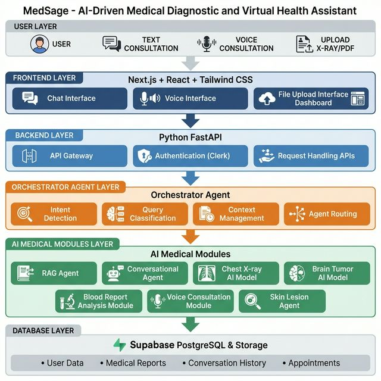
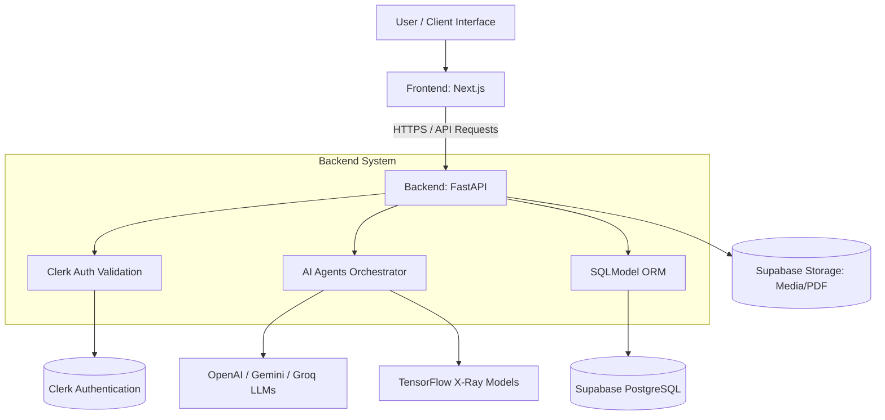
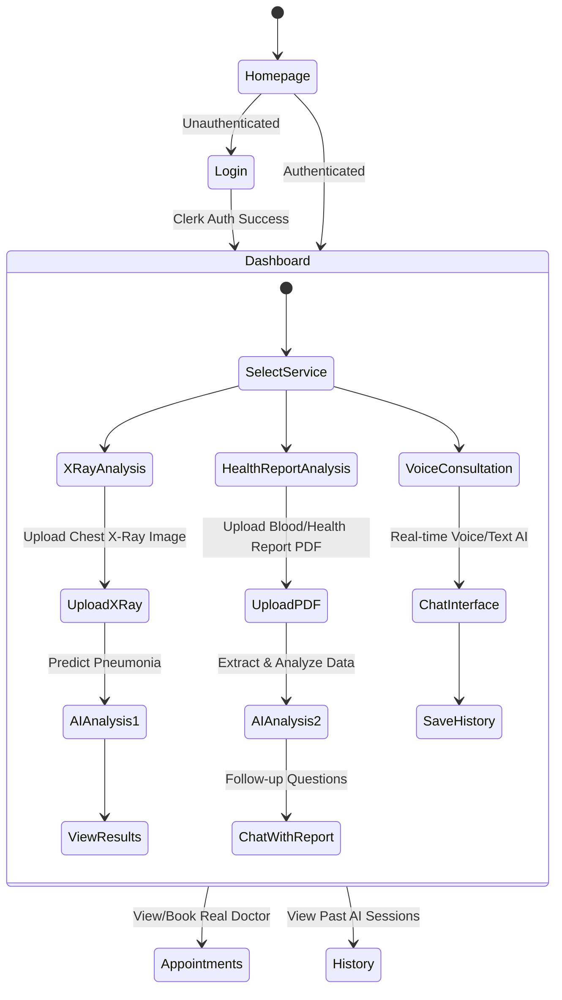
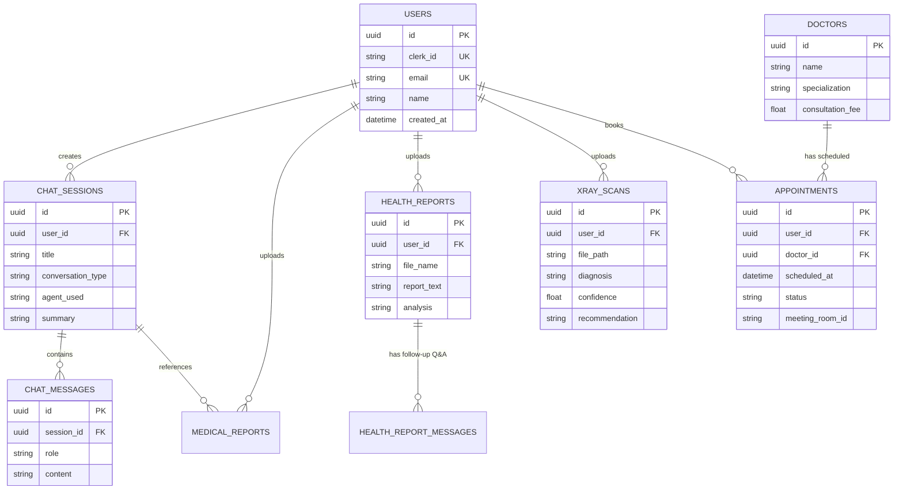
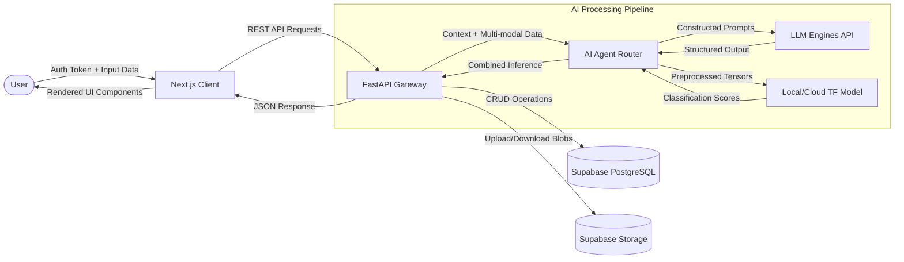
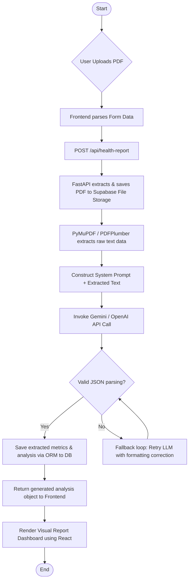

# AI Doctor Agent - System Diagrams

This document contains visual diagrams mapping out the architecture, user flows, database schemas, and data pipelines of the AI Doctor Agent project.

These diagrams are rendered using [Mermaid](https://mermaid.js.org/). Many markdown viewers (including GitHub) natively support viewing these diagrams.

## 1. System Architecture Diagram


This diagram shows the high-level infrastructure components and external service integrations, including all active features and planned modules (e.g., Brain Tumor analysis).



---

## 2. User Flow Diagram
This state diagram represents the primary journey a patient takes through the application from login to using the various AI services.



---

## 3. Entity-Relationship (ER) Diagram
This displays the relational database schema implemented using `SQLModel` connected to Supabase PostgreSQL.



---

## 4. Data Flow Diagram (DFD)
This diagram maps out how data securely passes between the User interface, Backend Router, AI components, and persistence layers.



---

## 5. Block Diagram
A high-level architectural block diagram representing the decoupling of frontend, API gateway, distinct AI services, and database.

```mermaid
flowchart TB
    subgraph Client Tier
        UI[React UI Components]
        State[State Management]
        XHR[Axios / Fetch Module]
    end
    
    subgraph API Tier
        FastAPI_Router[FastAPI Routers]
        Clerk_Auth[Clerk JWT Validator]
        Pydantic[Pydantic Validation]
    end
    
    subgraph Intelligence Tier
        Medical_Agent[Voice Consultation Agent]
        XRay_Agent[X-Ray Diagnostics Engine]
        Report_Agent[PDF Health Report Analyzer]
    end
    
    subgraph Data Tier
        SQLModel_ORM[SQLModel ORM Layer]
        Postgres[(Relational DB)]
        S3Bucket[(File Storage Blob)]
    end
    
    Client Tier -->|REST Calls| API Tier
    API Tier -->|Dispatch Task| Intelligence Tier
    Intelligence Tier -->|Read/Write Context| Data Tier
    API Tier -->|User/Logs Fetch| Data Tier
```

---

## 6. Detailed System Flowchart (Health Report Analysis)
A dedicated flowchart detailing the step-by-step logic of the Health Report processing feature.


